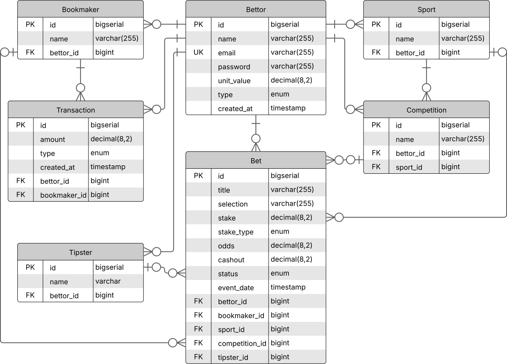

# Bettracker Architecture

This document outlines the data model and architecture for the Bettracker project.

---

## 1. Entity-Relationship Diagram (ERD)

The following diagram illustrates the database schema and the relationships between entities.

---

## 2. Entity Descriptions

* **Bettor:** It's the central entity that owns all other data.
* **Bet:** The core transactional entity, representing a single bet.
* **Bookmaker:** A user-defined list of betting sites.
* **Tipster:** A user-defined list of tipsters.
* **Sport:** A user-defined list of sports.
* **Competition:** A user-defined list of competitions, linked to a specific sport.
* **Transaction:** Records all financial movements (deposits and withdrawals).

